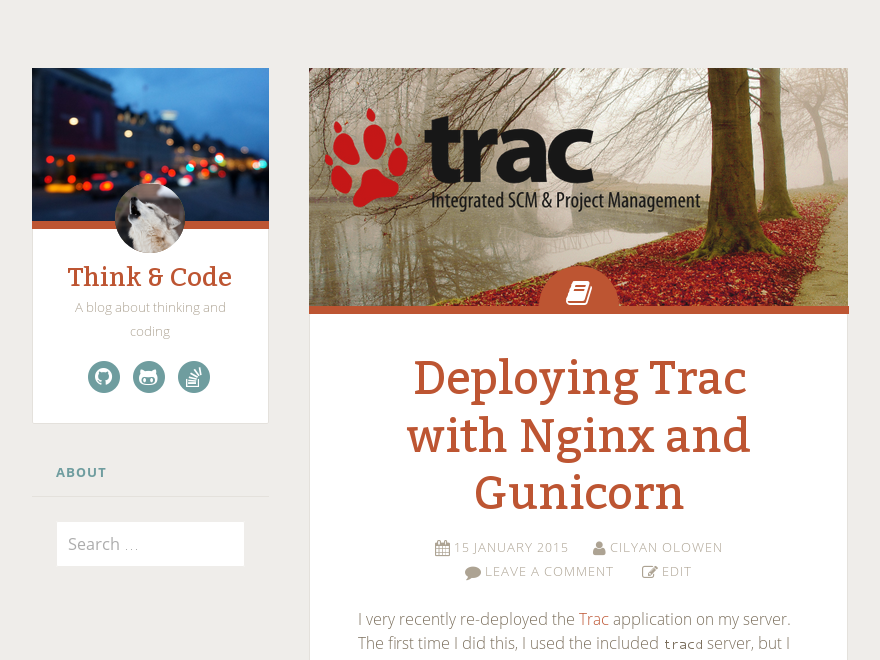

Fictive Cilyan
==============

This is a [WordPress](https://wordpress.org/) theme created for 
[cilyan.org](http://www.cilyan.org/) derived from
[Fictive by Automattic](https://wordpress.org/themes/fictive).

License: GNU General Public License v2 or later

Description
-----------

The theme ambiance is light, based on tuscany orange and sea nymph green 
(almost joking!). It supports a lot of WordPress niceties like post formats, 
custom header, featured images, special menus, ... Special **Social Links** 
menu is displayed in your header as icons in circles, and 
[Gravatar](https://secure.gravatar.com/) can be used to place your avatar in 
the header.

This derivate replaced [Genericons](http://genericons.com/) icons with 
[FontAwesome](https://fortawesome.github.io/Font-Awesome/) to include more 
brands for social links and the ability to select a local image as an avatar, 
if you don't want to setup a Gravatar account.

Installation
------------

If you did not get a ready-to-install zip, you'll have to create it. You will
need [Ruby](https://www.ruby-lang.org/)/[Rake](https://github.com/ruby/rake),
[SASS](http://sass-lang.com/), [Ruby-Gettext](https://ruby-gettext.github.io/)
and [7-zip](http://www.7-zip.org/). Once set up, type `rake` in a command line 
and it will build the release for you. Upload this file to your WordPress 
installation.

Usage
-----

Once installed, you have access to a bunch of options in the **Customize**
panel. By default, the administrator email is used to find the Gravatar
image. You can override this in the customize panel if you want to use another
email account. You can also upload and choose an avatar image and the theme
will use it instead of Gravatar. If you don't want any avatar to be shown,
remove the image and empty the email field. It also supports Jetpack and
Eventbrite.

Featured images are better when they are 634 pixels wide (or larger). They will
be displayed at the top of the post, both in the post lists as in the single 
post view.

Fictive supports Aside, Image, Video, Quote, Link, Gallery, Audio, and Status 
post formats. Each is denoted with a unique color and symbol.  Image formatted 
posts will display the Featured Image on single post view as well as the blog 
index and archives.  Link formatted post titles will link directly to the first 
link found in the post content.

Hacking
-------

Clone and Own, that's Github!

If you want to add an icon for a social link that's easy if an icon exists in 
[Font-Awesome](https://fortawesome.github.io/Font-Awesome/icons/#brand). Open 
`src/scss/_sociallinks.scss` and look at the examples. Font-Awesome variables 
are available so you don't need to search for the special character to use, 
just the icon name!
